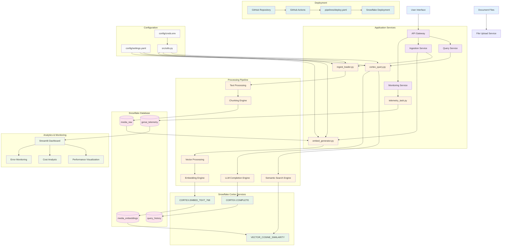
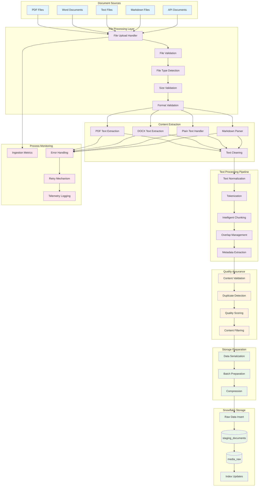
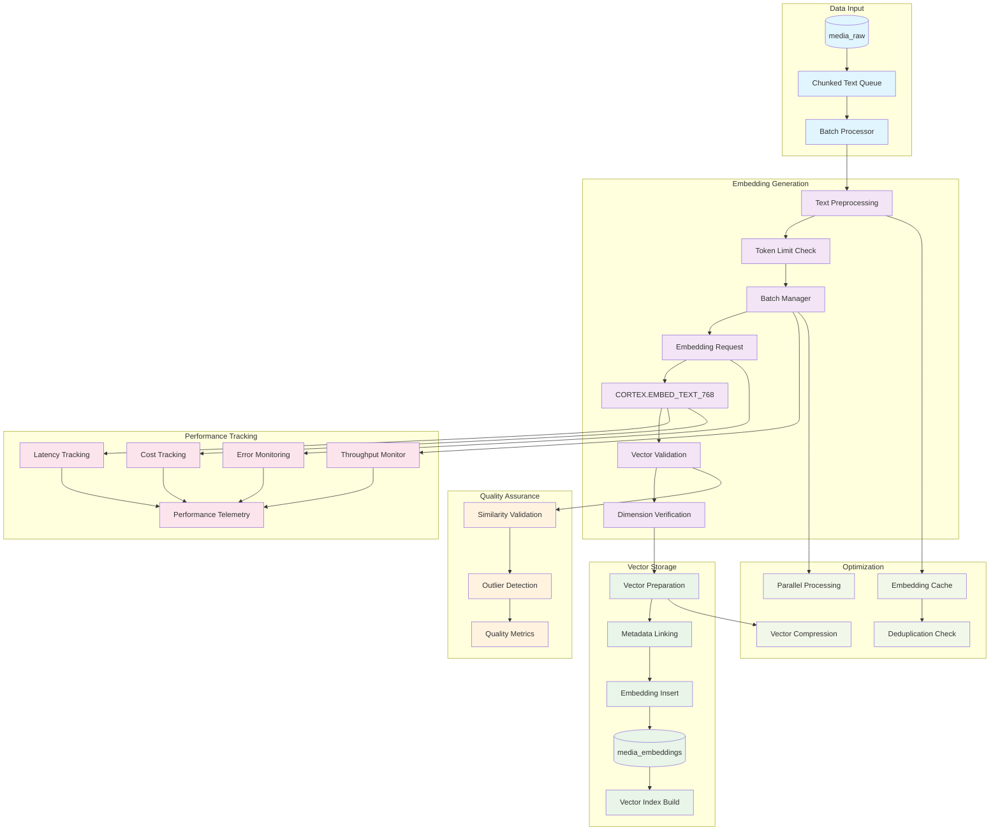
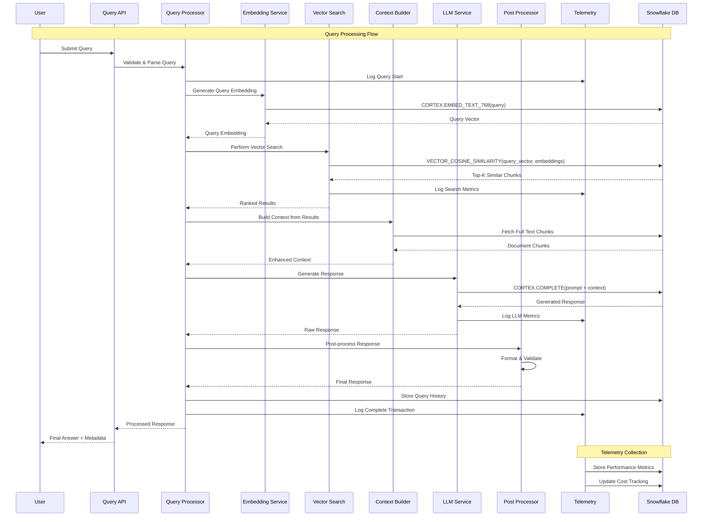
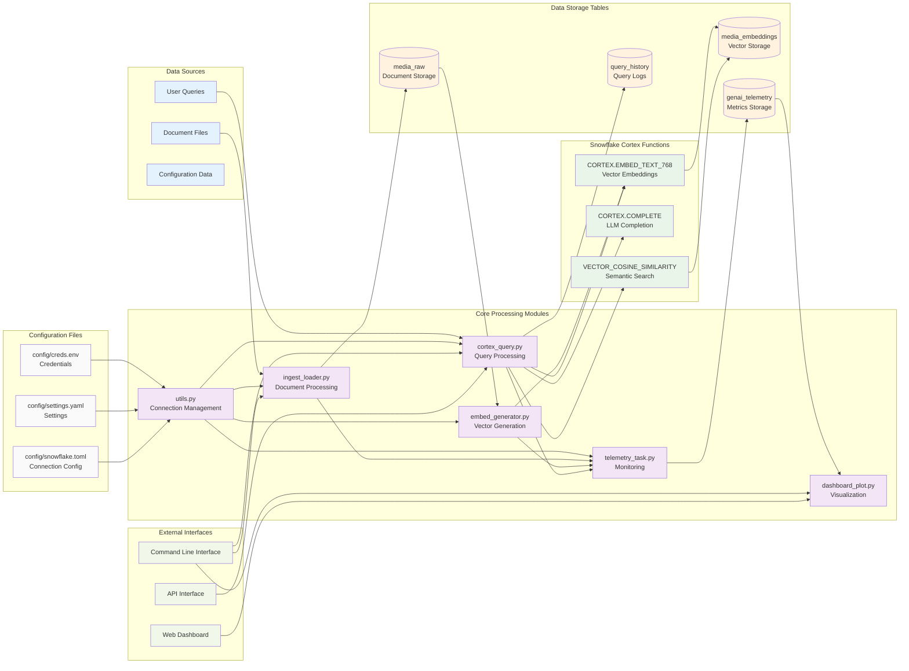
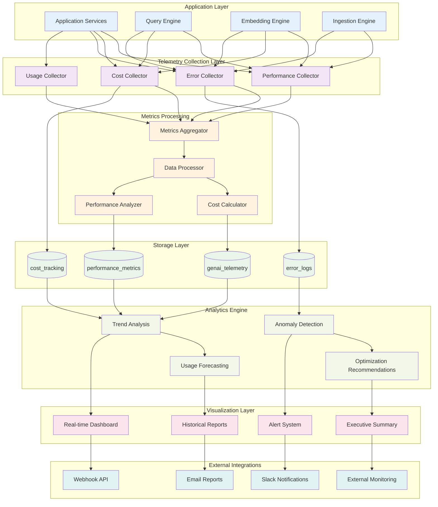
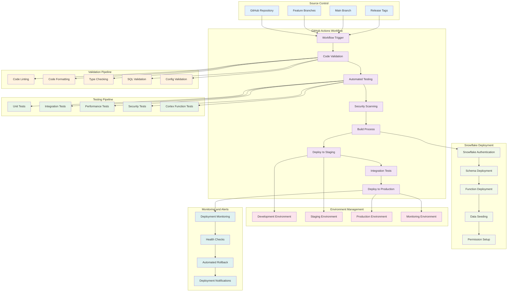
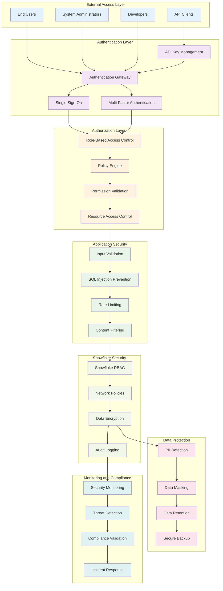

# Snowflake Cortex GenAI Pipeline - Detailed Architecture Diagrams

## System Overview

This document provides comprehensive architectural diagrams for the Snowflake Cortex GenAI Pipeline, illustrating the complete data flow, component interactions, and deployment architecture.

## 1. High-Level System Architecture

## 2. Document Ingestion Pipeline

## 3. Vector Embedding Pipeline

## 4. Query Processing and LLM Pipeline

## 5. Data Flow and Dependencies

## 6. Performance and Monitoring Architecture

## 7. Deployment and CI/CD Architecture

## 8. Security and Access Control Architecture

## Implementation Notes

1. **Scalability**: The architecture supports horizontal scaling through Snowflake's compute resources
2. **Reliability**: Built-in retry mechanisms and error handling ensure robust operation
3. **Performance**: Optimized data flow minimizes latency and maximizes throughput
4. **Security**: Multi-layered security approach protects data and ensures compliance
5. **Monitoring**: Comprehensive telemetry provides visibility into system performance
6. **Deployment**: Automated CI/CD ensures reliable and consistent deployments

## Next Steps

1. Review and validate architectural decisions
2. Implement monitoring and alerting systems
3. Set up automated testing and deployment pipelines
4. Establish security policies and access controls
5. Create operational runbooks and documentation