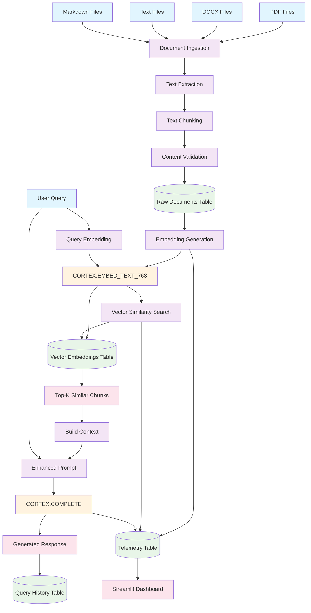
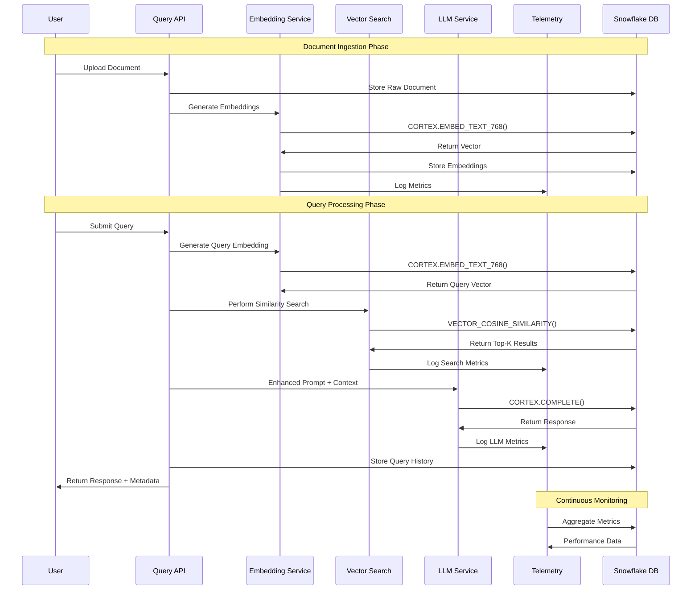
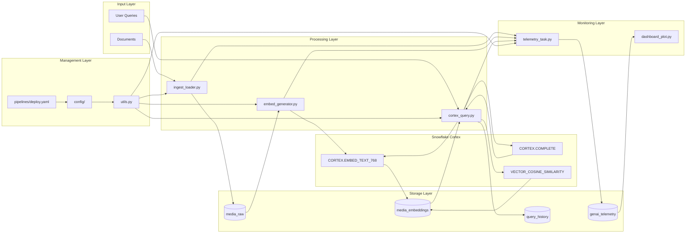
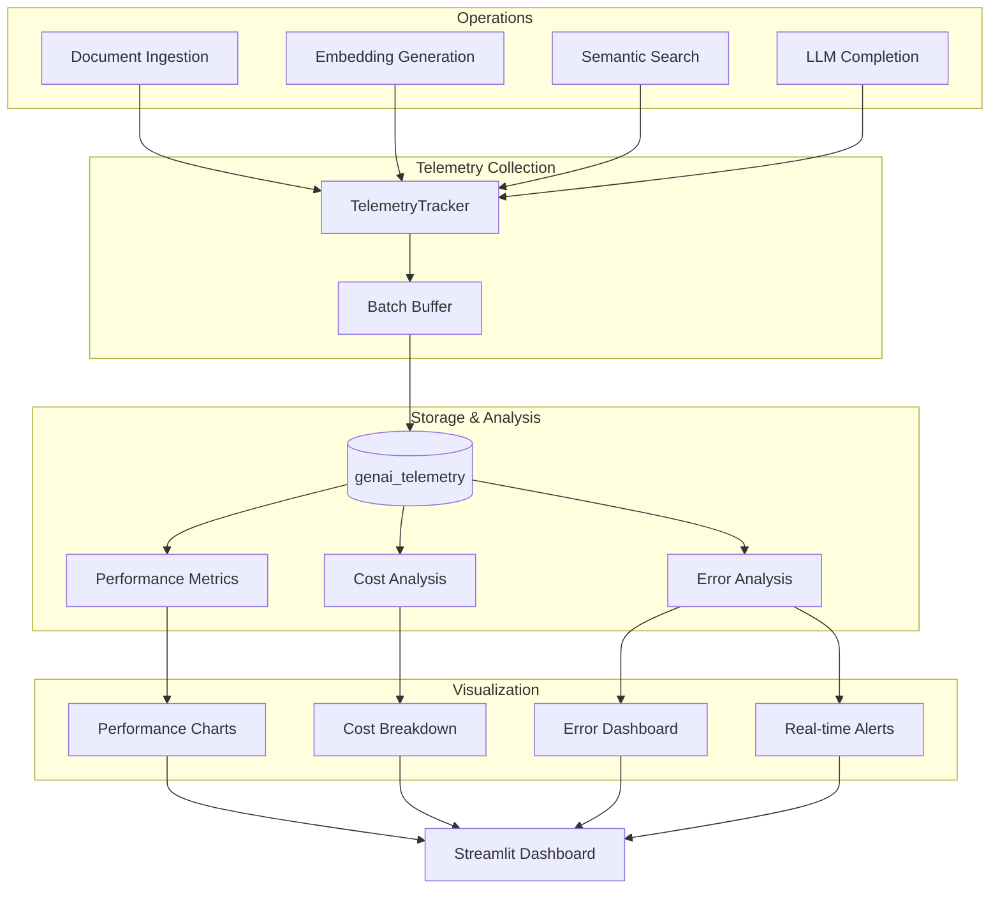
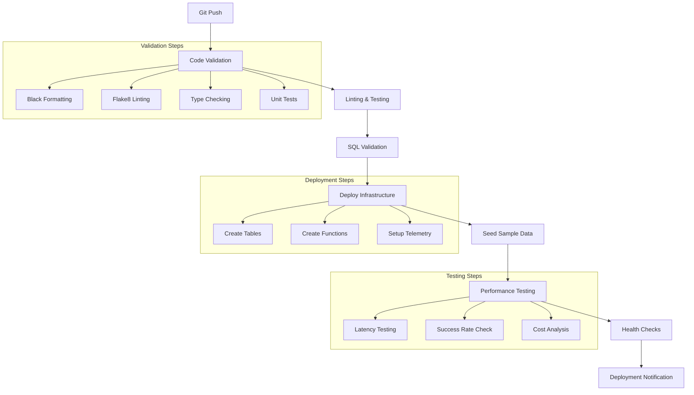
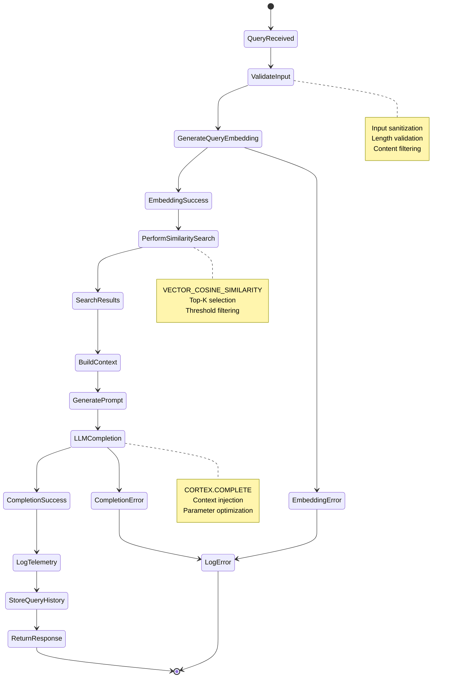

# Snowflake Cortex GenAI Pipeline - Flow Diagram

## High-Level Architecture Flow



## Detailed Data Flow Diagram



## Component Interaction Flow



## Telemetry Data Flow



## CI/CD Pipeline Flow



## Query Processing Detailed Flow



---

## ASCII Flow Diagrams (Viewable in Text Editor)

### Main Pipeline Flow

```
┌─────────────┐    ┌──────────────┐    ┌─────────────┐    ┌──────────────┐
│   PDF/DOCX  │───►│   INGESTION  │───►│   CHUNKING  │───►│  VALIDATION  │
│    Files    │    │ ingest_loader│    │   & CLEAN   │    │   & STORE    │
└─────────────┘    └──────────────┘    └─────────────┘    └──────────────┘
                                                                    │
                                                                    ▼
┌─────────────┐    ┌──────────────┐    ┌─────────────┐    ┌──────────────┐
│ User Query  │───►│Query Embedding│───►│Vector Search│◄───┤ RAW_DOCUMENTS│
│             │    │CORTEX.EMBED  │    │COSINE_SIMILARITY│ │    TABLE     │
└─────────────┘    └──────────────┘    └─────────────┘    └──────────────┘
      │                                         │                  │
      │                                         ▼                  ▼
      │            ┌──────────────┐    ┌─────────────┐    ┌──────────────┐
      │            │   CONTEXT    │◄───┤ TOP-K CHUNKS│◄───┤  EMBEDDINGS  │
      │            │  BUILDING    │    │   SIMILAR   │    │    TABLE     │
      │            └──────────────┘    └─────────────┘    └──────────────┘
      │                     │
      ▼                     ▼
┌─────────────┐    ┌──────────────┐    ┌─────────────┐    ┌──────────────┐
│   PROMPT    │───►│CORTEX.COMPLETE│───►│  RESPONSE   │───►│QUERY HISTORY │
│ ENHANCEMENT │    │    (LLM)     │    │ GENERATION  │    │    TABLE     │
└─────────────┘    └──────────────┘    └─────────────┘    └──────────────┘
                            │                   │                  │
                            ▼                   ▼                  ▼
                   ┌──────────────┐    ┌─────────────┐    ┌──────────────┐
                   │  TELEMETRY   │    │  TELEMETRY  │    │  TELEMETRY   │
                   │  (Latency)   │    │   (Costs)   │    │ (Success)    │
                   └──────────────┘    └─────────────┘    └──────────────┘
                            │                   │                  │
                            └───────────────────┼──────────────────┘
                                               ▼
                                    ┌──────────────┐
                                    │  STREAMLIT   │
                                    │  DASHBOARD   │
                                    └──────────────┘
```

### Component Architecture

```
┌─────────────────────────────────────────────────────────────────────────┐
│                         SNOWFLAKE CORTEX GENAI PIPELINE                 │
├─────────────────────────────────────────────────────────────────────────┤
│                                                                         │
│  ┌─────────────┐  ┌─────────────┐  ┌─────────────┐  ┌─────────────┐   │
│  │    utils    │  │ingest_loader│  │embed_generator│ │cortex_query │   │
│  │   .py       │  │    .py      │  │    .py      │  │    .py      │   │
│  │             │  │             │  │             │  │             │   │
│  │• Connection │  │• Doc Upload │  │• Embedding  │  │• Semantic   │   │
│  │• Config     │  │• Text Extract│  │• Vector Gen │  │• Search     │   │
│  │• Logging    │  │• Validation │  │• Storage    │  │• LLM Query  │   │
│  └─────────────┘  └─────────────┘  └─────────────┘  └─────────────┘   │
│         │                 │                 │                 │       │
│         └─────────────────┼─────────────────┼─────────────────┘       │
│                           │                 │                         │
│  ┌─────────────┐  ┌─────────────┐  ┌─────────────┐  ┌─────────────┐   │
│  │telemetry_   │  │dashboard_   │  │             │  │             │   │
│  │  task.py    │  │  plot.py    │  │   CONFIG/   │  │NOTEBOOKS/   │   │
│  │             │  │             │  │             │  │             │   │
│  │• Metrics    │  │• Streamlit  │  │• snowflake  │  │• SQL Demo   │   │
│  │• Monitoring │  │• Charts     │  │• .env       │  │• Examples   │   │
│  │• Costs      │  │• Analytics  │  │• logging    │  │• Tests      │   │
│  └─────────────┘  └─────────────┘  └─────────────┘  └─────────────┘   │
│                                                                         │
└─────────────────────────────────────────────────────────────────────────┘
                                    │
                                    ▼
            ┌─────────────────────────────────────────────────┐
            │             SNOWFLAKE CORTEX FUNCTIONS          │
            ├─────────────────────────────────────────────────┤
            │                                                 │
            │  CORTEX.EMBED_TEXT_768()  │  CORTEX.COMPLETE()  │
            │  • Text → Vector          │  • Prompt → Text    │
            │  • 768 dimensions         │  • Multiple Models  │
            │  • Multilingual           │  • Context Aware    │
            │                          │                     │
            │     VECTOR_COSINE_SIMILARITY()                  │
            │     • Semantic Search                           │
            │     • Relevance Ranking                         │
            │     • Fast Vector Ops                           │
            └─────────────────────────────────────────────────┘
```

### Data Flow Process

```
INPUT DOCUMENTS
       │
       ▼
┌─────────────┐
│ Text Extract│ ───► Split into chunks ───► Validate content
└─────────────┘
       │
       ▼
┌─────────────┐         ┌─────────────┐         ┌─────────────┐
│Store in RAW │────────►│Generate     │────────►│Store Vector │
│Documents    │         │Embeddings   │         │Embeddings   │
│Table        │         │CORTEX.EMBED │         │Table        │
└─────────────┘         └─────────────┘         └─────────────┘
                                                        │
                                                        │
USER QUERY                                              │
    │                                                   │
    ▼                                                   │
┌─────────────┐         ┌─────────────┐                │
│Embed Query  │────────►│Find Similar │◄───────────────┘
│CORTEX.EMBED │         │Chunks       │
└─────────────┘         │COSINE_SIM   │
                        └─────────────┘
                                │
                                ▼
                        ┌─────────────┐
                        │Build Context│
                        │from Top-K   │
                        │Chunks       │
                        └─────────────┘
                                │
                                ▼
                        ┌─────────────┐         ┌─────────────┐
                        │Enhanced     │────────►│LLM Response │
                        │Prompt       │         │CORTEX.      │
                        │             │         │COMPLETE     │
                        └─────────────┘         └─────────────┘
                                                        │
                                                        ▼
                                                ┌─────────────┐
                                                │Return to    │
                                                │User +       │
                                                │Log Metrics  │
                                                └─────────────┘
```

### Telemetry & Monitoring Flow

```
OPERATIONS                    TELEMETRY COLLECTION              STORAGE
     │                             │                              │
┌────▼────┐                 ┌──────▼──────┐              ┌──────▼──────┐
│Ingestion│────────────────►│TelemetryTask│─────────────►│Telemetry    │
├─────────┤                 ├─────────────┤              │Table        │
│Embedding│────────────────►│• Latency    │              ├─────────────┤
├─────────┤                 │• Costs      │              │• Performance│
│Search   │────────────────►│• Success    │              │• Costs      │
├─────────┤                 │• Errors     │              │• Errors     │
│LLM Call │────────────────►│• Batch      │              │• Trends     │
└─────────┘                 └─────────────┘              └─────────────┘
                                   │                              │
                                   ▼                              ▼
                            ┌─────────────┐              ┌─────────────┐
                            │Real-time    │◄─────────────┤Dashboard    │
                            │Alerts       │              │Analytics    │
                            │• Failures   │              │• Charts     │
                            │• High Costs │              │• Metrics    │
                            │• Latency    │              │• Reports    │
                            └─────────────┘              └─────────────┘
```

### File Structure Tree

```
snowflake_genai_demo/
├── src/
│   ├── utils.py              # Core utilities & connection management
│   ├── ingest_loader.py      # Document ingestion pipeline  
│   ├── embed_generator.py    # Embedding generation with Cortex
│   ├── cortex_query.py       # Semantic search & LLM completion
│   ├── telemetry_task.py     # Performance monitoring & metrics
│   └── dashboard_plot.py     # Streamlit analytics dashboard
│
├── config/
│   ├── snowflake.yaml       # Database connection config
│   ├── logging.yaml         # Logging configuration
│   └── .env.template        # Environment variables template
│
├── notebooks/
│   └── cortex_demo.ipynb    # SQL demo and examples
│
├── docs/
│   ├── README.md            # Complete project documentation
│   ├── flow_diagram.md      # Mermaid flow diagrams
│   └── presentation.md      # Project presentation content
│
├── pipelines/
│   └── deploy.yaml          # CI/CD GitHub Actions pipeline
│
├── prompts/
│   └── github_copilot.md    # AI assistant prompts
│
└── requirements.txt         # Python dependencies
```