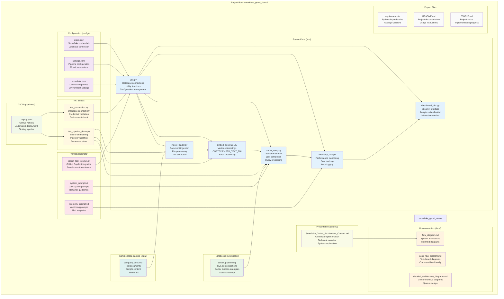
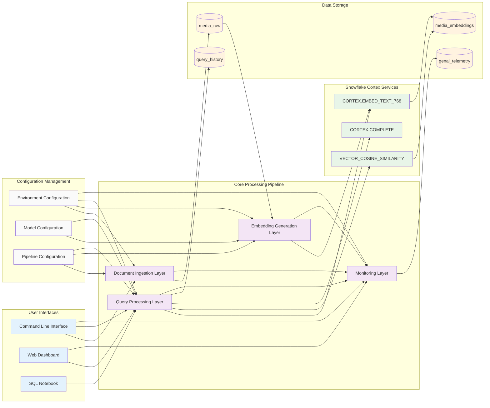
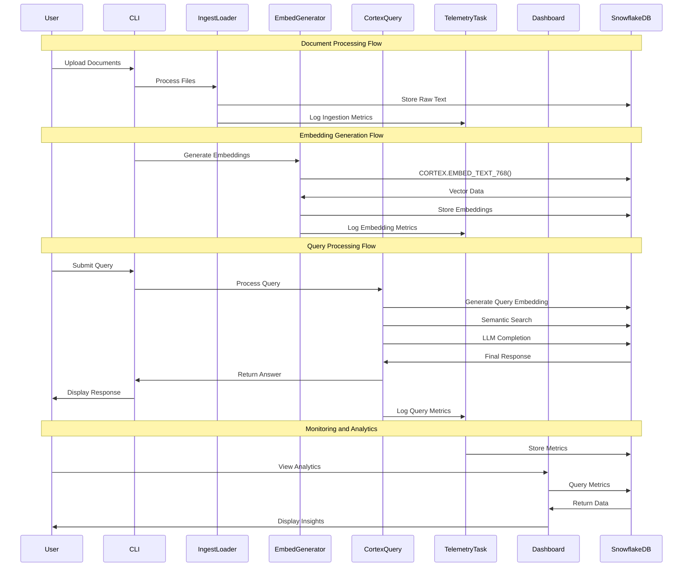
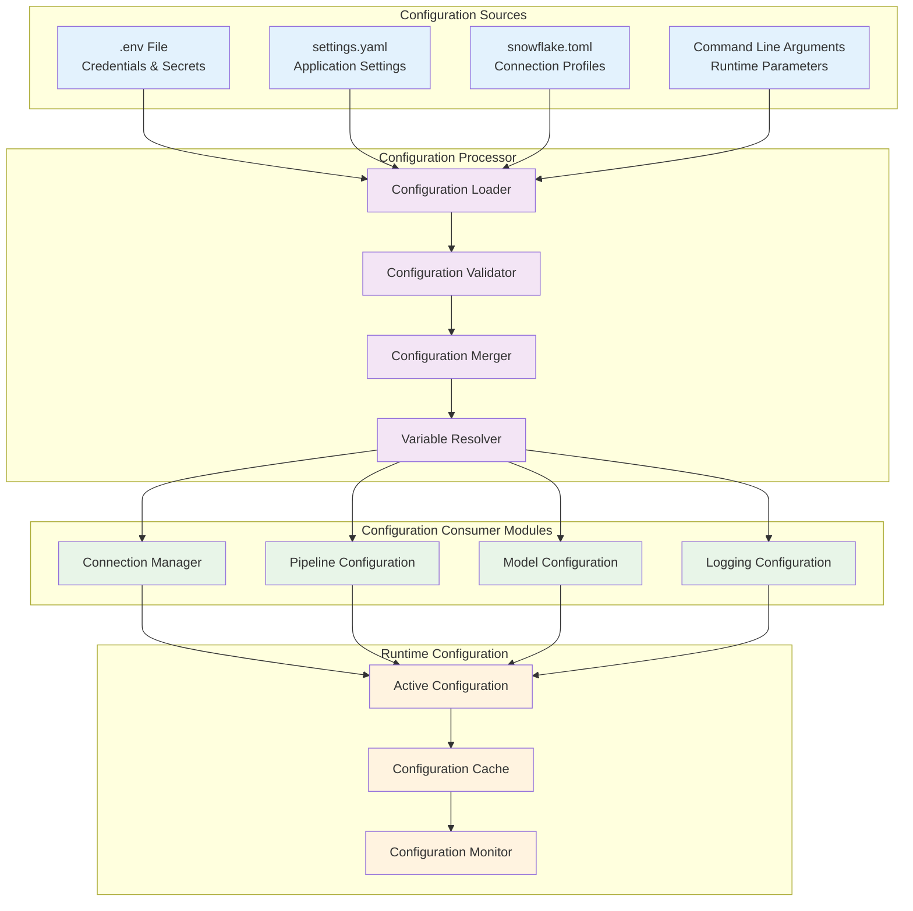
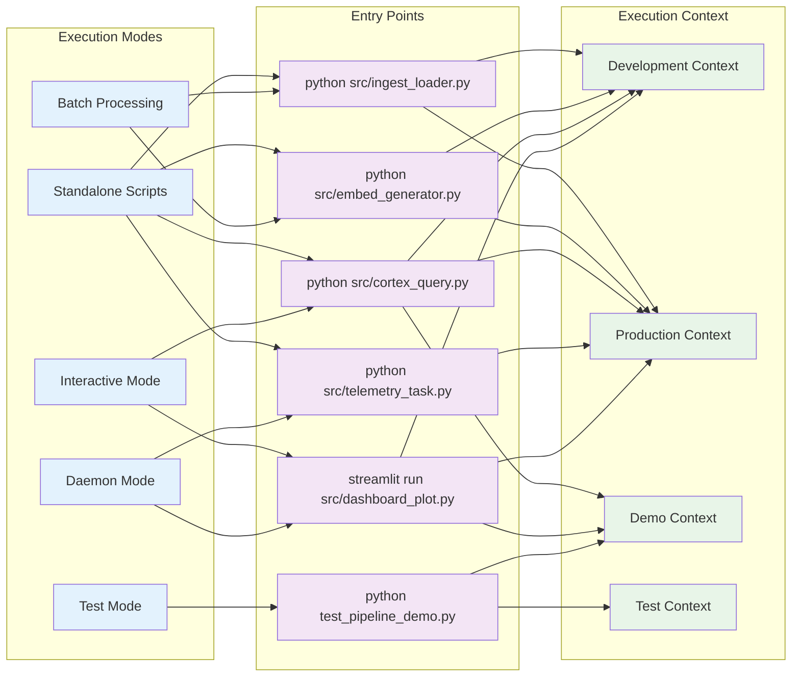

# Snowflake Cortex GenAI Pipeline - Project Structure and Component Overview

## Project Structure Visualization

## Component Interaction Map

## Module Responsibility Matrix

| Module | Primary Function | Input | Output | Dependencies |
|--------|------------------|--------|---------|--------------|
| `utils.py` | Database connection management | Configuration files | Database connections | snowflake-connector-python |
| `ingest_loader.py` | Document processing and ingestion | PDF, DOCX, TXT, MD files | Structured text chunks | utils.py, PyPDF2, python-docx |
| `embed_generator.py` | Vector embedding generation | Text chunks | Vector embeddings | utils.py, CORTEX.EMBED_TEXT_768 |
| `cortex_query.py` | Query processing and response | User queries | Generated responses | utils.py, embed_generator.py |
| `telemetry_task.py` | Performance monitoring | System metrics | Telemetry data | utils.py, all processing modules |
| `dashboard_plot.py` | Analytics visualization | Telemetry data | Interactive dashboard | streamlit, plotly, utils.py |

## Data Flow Specification

## Configuration Architecture

## Execution Modes and Entry Points

This comprehensive project structure documentation provides:

1. **Visual Project Structure**: Complete file organization and dependencies
2. **Component Interaction Map**: How modules communicate with each other
3. **Module Responsibility Matrix**: Clear definition of each module's role
4. **Data Flow Specification**: Sequence of operations across the system
5. **Configuration Architecture**: How settings and configuration are managed
6. **Execution Modes**: Different ways to run the system

Each diagram uses consistent styling and provides clear visibility into the system architecture and component relationships.